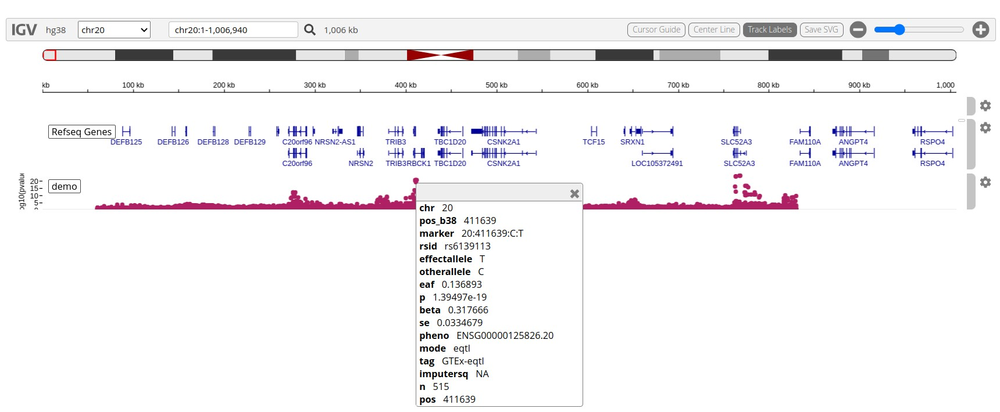

# Introduction

This package illustrates how to produce informative interactive
visualizations for GWAS summary statistics, based on the igvR package
in Bioconductor.  Of particular concern is juxtaposition and visualization
of GWAS summaries and "genomic QTL" findings, such as scores for eQTL pairs (variant and
gene).

# Example

A main problem is extracting information from archives of GWAS
summary statistics.  We use an example data frame, `gtex_b38_lung_chr20_exc`,
which has EQTL p-values for a small number of genes on chr20, derived from GTEx 
results for lung tissue..

```{r do1}
suppressPackageStartupMessages({
  library(igv4gq)
})
data(gtex_b38_lung_chr20_exc)
chk2 = gtex_b38_lung_chr20_exc |> filter_sym("SOX12", radius=5e5) |> as.data.frame()
head(chk2)
```

To visualize these results, we can use igvR and its GWASTrack display
method.  For a very simple demonstration, we have a function `gwviz`
in igv4gq.

```{r dobr, eval=FALSE}
gwviz(table=chk2, chrom.col=1, pval.col=8, pos.col=16)
```

The result can be zoomed using the controls, to find:



In this display we have recorded the result of clicking on a high-scoring
SNP near TRIB3.  A table of metadata is displayed.

This method assumes all the variant data and metadata are in
a single data.frame, all in memory.
